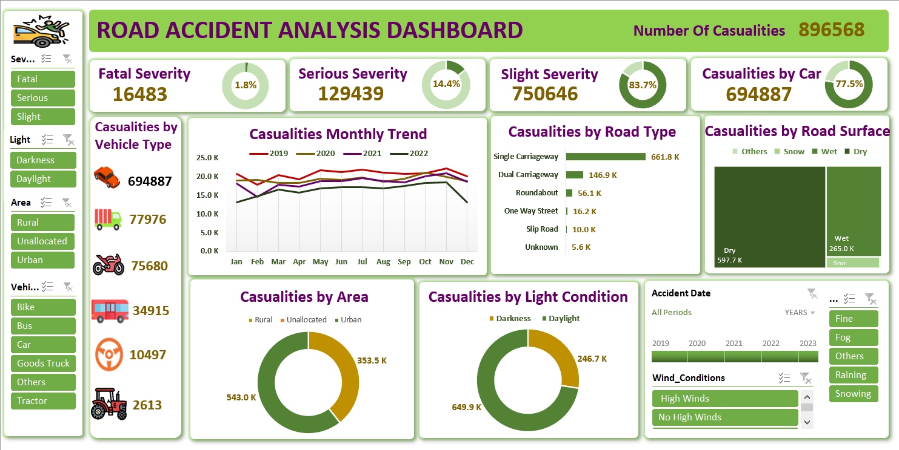

# Road Accident Analysis Dashboard

## Description
This Excel dashboard provides a detailed analysis of road accident data. 
It includes visualizations of accidents by severity: fatal, slight, and severe. 
The dashboard breaks down the data by road type, vehicle type, month-to-month trends, road surface conditions, area, and lighting conditions. 
These insights allow users to quickly identify patterns and trends in accident occurrences, helping to highlight high-risk areas, times, and conditions. 
The dashboard is designed to support data-driven decisions for improving road safety.
## Key Insights
1. Fatal accidents are most frequent on **Single Carriageways** and least frequent on **Slip Roads**.
2. Accidents are most common involving **cars** and least common involving **tractors**.
3. Accident occurrences increase during **rainy months**, indicating weather significantly impacts road safety.
4. Urban areas have the highest number of **casualties**, highlighting high-risk zones in cities.
5. Most casualties occur during **daytime**, indicating higher traffic exposure leads to increased risk.
6. Casualties peaked in **2019** with 247,780, followed by a gradual decline in subsequent years, showing a positive trend in road safety improvements.
